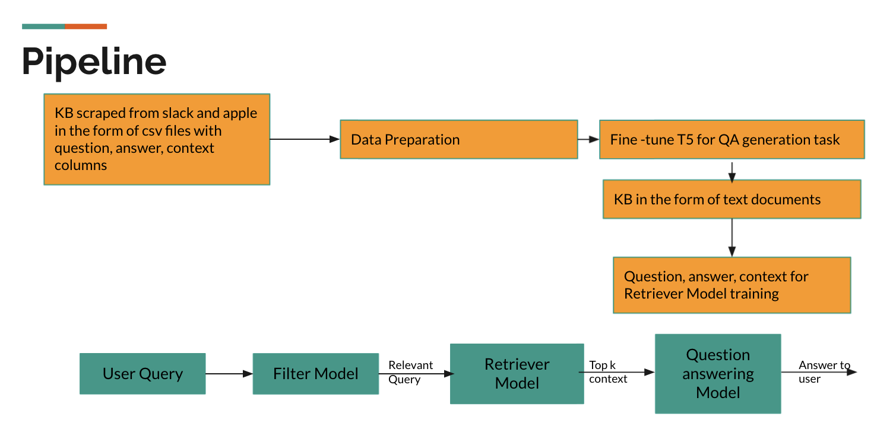

# Knowledge Retrieval Framework using T5 and Bert

This knowledge retrieval system was created by Justin Barber, Russell Chen, and Ritu Singhal. This repo has all the pieces for creating a knowledge retrieval and dialog system using a free text corpus.

## Pipeline
  
  
## Model Components

### Scraper (KB generation)
Code for scraping knowledge from a website is in the scraper folder.

### Filter Model
This model first splits the input queries in sentences and then each sentence is classified as relevant/irrelevant. Only the relevant portion of the query is passed
along.
Code is under models/filter.py.

### T5
This portion has been taken from this github :- https://github.com/patil-suraj/question_generation
Scraped slack data was pre-processed and used for finetuning. And then QA task was used to generate question answer pairs.

### Retriever/Reader Model
The retriever model is responsible for finding the best documents to answer a given question.
Every document is converted into an embedding, and every question is also converted to embedding using a separate model of the same architecture.
When the question is converted into an embedding, the k product similarity gives back the k most similar contexts.

The reader model, on the other hand, is A simple BERT-like model configured for question answering tasks.
The documents returned by the retriever model constitute the context for the reader model.
The reader model then tries to find the snippet of this context that best answers the question.

## Usage

For now, the reader model can be trained with the `train.py` script.

To run inference on the model in AWS, see the `awsdeployment/deployment.ipynb` notebook.
The files in AWS deployment need also to be uploaded to the directory of the SageMaker notebook.

We will accept command line arguments soon.
